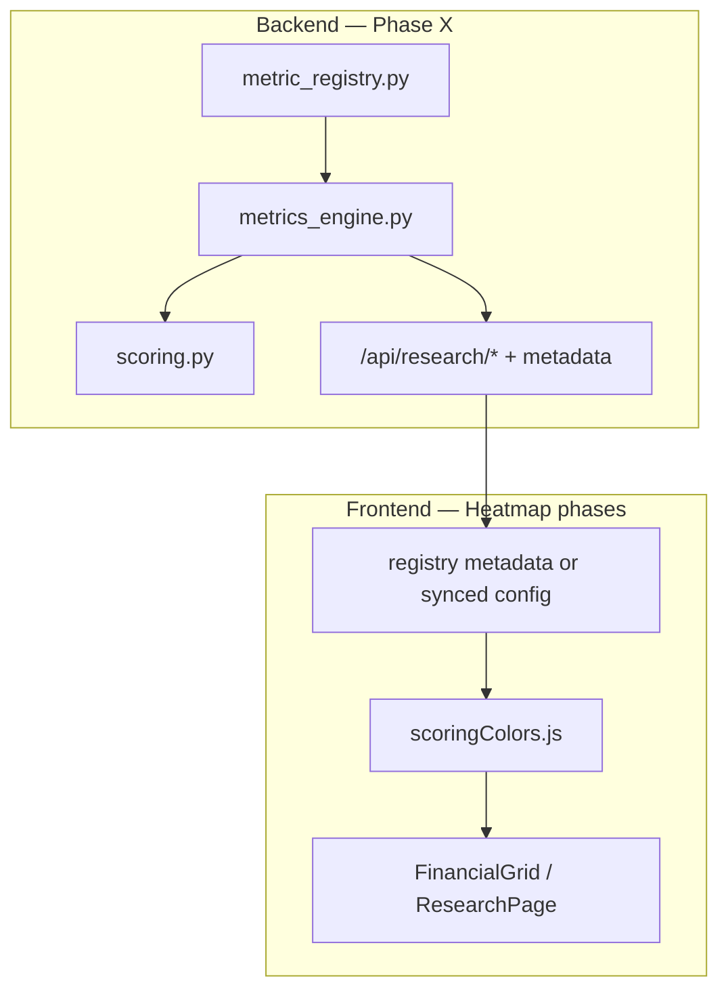

# Heatmap, Scoring & Canonical Metrics Plan

**Status:** Phase X (X1–X3) + Heatmap H1–H3 implemented  
**Last updated:** 2026-06-09

See also: [`UI_PHILOSOPHY.md`](./UI_PHILOSOPHY.md), [`CSS_REFACTOR_PLAN.md`](./CSS_REFACTOR_PLAN.md), [`../../stock_tracker_backend/docs/RESEARCH_WORKSTATION_PLAN.md`](../../stock_tracker_backend/docs/RESEARCH_WORKSTATION_PLAN.md)

---

## Overview

Two related efforts:

1. **Frontend heatmap / conditional formatting** — institutional deep-value spreadsheet coloring on the research grid.
2. **Phase X — Canonical Metrics & Ratios Engine** — backend single source of truth for all derived analytics.

Phase X is the **foundation**. Heatmap phases 1–3 can ship on today's limited metric set; full coverage, sector percentiles, and consistent screener/ranking behavior depend on Phase X.



---

# Part A — Heatmap & Conditional Formatting

## Goal

The research financial grid should feel like an institutional deep-value research spreadsheet, not a consumer dashboard heatmap:

- rapid anomaly spotting
- historical trend cognition
- asymmetric opportunity detection
- margin/quality stabilization visibility
- survivability scanning

Visual reference: institutional research spreadsheet, deep-value workstation, high-density terminal grid.

**Avoid:** giant cards, over-rounded borders, decorative animations, generic blue→green column heatmaps for valuation ratios.

---

## Architecture (frontend)

```
metric metadata (from API or synced registry)
        ↓
researchMetrics.js          display groups + metric keys
        ↓
ResearchPage.js             builds rows; precomputes historical stats + heat styles
        ↓
scoringColors.js            getMetricBackground(metricKey, value, context)
        ↓
heatMap.js                  palette primitives (green/red/amber/purple steps)
        ↓
FinancialGrid               applies cellStyle + tooltips on <td>
```

**Primary grid:** `FinancialGrid` on `/research` (deep-dive + screener).  
`DataGrid` on legacy `FinancialsPage` is out of scope for the first pass.

**Central utility:** `src/utils/scoringColors.js`

| Export | Purpose |
|--------|---------|
| `getMetricColor` | CSS color string for foreground |
| `getMetricBackground` | `{ backgroundColor, color, fontVariantNumeric }` cell style |
| `getMetricTextColor` | Foreground only |
| `getTrendColor` | Delta / YoY / CAGR arrow color |
| `getScoreTier` | 0–5 tier for legend + testing |
| `buildHistoricalStats` | Row-wise percentile breakpoints from period values |
| `describeHeat` | Tooltip text for a colored cell |

Registry metadata (`higher_is_better`, `danger_threshold`, `heatmap_mode`) should eventually be **read from the backend** rather than duplicated in `researchMetrics.js`.

---

## Color modes

| Mode | Default | Behavior |
|------|---------|----------|
| `deep_value` | **yes** | Fixed deep-value thresholds from registry |
| `historical` | | Value vs the company's own period range (deep-dive rows) |
| `sector` | | vs sector/industry percentiles — requires Phase X aggregation |

Negative values **always** force red, overriding percentile logic.

Purple appears **only** for exceptional outliers (elite profitability, extremely cheap valuation, very safe balance sheet, elite scores).

---

## Metric categories (heatmap behavior)

### 1. Profitability

Percentile or gradient-based; negative → red. Historical scale: bottom 20% dark red → 95%+ purple.

### 2. Valuation (inverted)

Cheaper / lower leverage = greener. Extremely cheap outliers → purple.

### 3. Distress / survivability (fixed thresholds)

Altman Z, current ratio, D/E, survivability score — fixed bands, not percentiles.

### 4. Trend

YoY %, CAGR %, margin deltas, dilution — deterioration red, improvement green; dilution inverted.

### 5. Score

Piotroski, Beneish, survivability, insider intensity — discrete tiers.

Aligns with backend `survivability_bucket()` in `scoring.py`.

---

## Grid UX

- Hover tooltips via `describeHeat` / `title` on cells
- Sticky metric column unchanged
- Trend arrows (▲ ▼) via `getTrendColor`
- Toolbar: **Color mode** selector + **legend** toggle
- Compact spreadsheet density preserved (`st-grid-table-compact`)

---

## Heatmap implementation phases

| Phase | Scope | Depends on |
|-------|--------|------------|
| **H1** | `scoringColors.js` API, purple tier, `deep_value` for **existing** keys | Done |
| **H2** | Deep-dive grid, `historical` mode, tooltips, trend colors | Done |
| **H3** | Screener grid, toolbar color mode, legend, valuation inversion | Done |
| **H4** | Sector percentile coloring | Phase X (sector stats) |
| **H5** | `ScoringPanel` badge alignment, user pref persistence | H1 |

**Do not block H1–H3 on Phase X.** Phase X unblocks full metric coverage and H4.

---

# Part B — Phase X: Canonical Metrics & Ratios Engine

## Goal

Create a centralized financial metrics/ratios engine that powers:

- research grid
- screener
- scoring models
- heatmaps
- ranking systems
- exports
- future AI/narrative analysis

**Single source of truth** for all derived financial analytics. No duplicated ratio logic across frontend, API routes, scoring, screener, or research panels.

---

## Sanity check vs current codebase

**The proposal makes sense** and matches the monorepo's SQLite-first, incremental architecture. Key findings from audit:

### What already exists (partial engine)

| Location | Role today |
|----------|------------|
| `fundamentals.py` → `build_company_metrics()` | De-facto per-period metrics (~20 keys, camelCase JSON) |
| `scoring.py` | Piotroski, Altman, Beneish, survivability + private helpers |
| `research.py` | Calls both; adds ad-hoc `marginTrends`, `shareDilutionRate` |
| `company_scores` table | Materialized score rows per period |
| `researchMetrics.js` | Frontend metric display config (duplicated metadata) |
| `portfolioColumns.js` | Another frontend metric list |
| `researchCalculations.js` | Client-side YoY / CAGR (duplicates backend trend need) |

### Confirmed duplication (must consolidate)

| Logic | Location A | Location B |
|-------|------------|------------|
| Gross margin | `build_company_metrics` | `scoring._gross_margin` |
| Operating margin | — (not exposed) | `scoring._operating_margin` |
| ROA | `build_company_metrics` | `scoring._roa` |
| FCF derivation | `build_company_metrics` | `scoring._fcf` |
| Debt aggregation | `build_company_metrics` | `scoring._debt` |
| Current ratio | `build_company_metrics` | `scoring._current_ratio` |
| Leverage | — | `scoring._leverage` |
| YoY / CAGR | — | `researchCalculations.js` (frontend) |
| Metric labels / format | `researchMetrics.js` | `portfolioColumns.js`, `CompareMetricsPanel.js` |

### Naming convention (proposed)

| Layer | Convention | Example |
|-------|------------|---------|
| Registry + engine (Python) | `snake_case` keys | `gross_margin`, `ev_ebitda` |
| JSON API (stable contract) | `camelCase` | `grossMargin`, `ebitdaEv` |
| Frontend registry sync | `camelCase` keys matching API | same as today |

Do **not** break existing API field names in one shot. Engine emits canonical snake_case; API layer maps to established camelCase.

### Data availability caveats

Some Phase X metrics need fields or sources **not yet reliable** in SEC XBRL:

| Metric | Status |
|--------|--------|
| `forward_pe` | No consensus estimates pipeline — defer or mark `unavailable` |
| `debt_maturity_risk` | Not in current wide schema — defer |
| `burn_rate` / `cash_runway` | Needs quarterly opex context; partial |
| `ncav` / `net_net` | Derivable from assets, liabilities, intangibles — implementable |
| `tangible_book` | Needs intangibles/goodwill (in schema) — implementable |
| `quick_ratio` | Needs inventory (in schema) — implementable |
| `roic` / `roce` | Needs invested capital definition — implementable with proxies |

**Rule:** return `null` / `unavailable` / `insufficient_data` — never silent misleading values.

### `zscore` vs `altman_z`

Use **`altman_z`** as the canonical key. Alias `zscore` only if needed for external compatibility; avoid two keys for the same score.

---

## Phase X — deliverables

### 1. Metric registry (`app/services/metric_registry.py`)

Central registry defining per metric:

| Field | Purpose |
|-------|---------|
| `key` | Canonical snake_case id |
| `category` | profitability, valuation, liquidity, growth, deep_value, distress |
| `label` | Display name |
| `format` | percent, decimal, usd, integer, text |
| `higher_is_better` | Drives heatmap inversion + ranking |
| `heatmap_mode` | percentile, fixed_threshold, inverted_percentile, score_tier |
| `danger_threshold` / `excellent_threshold` | Deep-value fixed bands |
| `screener_supported` | Include in screener groups |
| `time_series` | Appears in deep-dive period columns |
| `trend_capable` | YoY / CAGR / delta supported |
| `compute_fn` | Reference to engine function |
| `api_key` | camelCase JSON alias |

Registry drives: grid metadata API, heatmap rules, exports, screeners, rankings, tooltips.

### 2. Metrics engine (`app/services/metrics_engine.py`)

Responsibilities:

- Compute all derived metrics in one place
- Normalize SEC/XBRL wide rows (reuse `build_company_metrics` logic, then extend)
- Return stable canonical keys per period
- Support annual / quarterly / TTM (reuse `compute_ttm_rows`, dimension resolution)
- Trend helpers: YoY, QoQ, 3y/5y CAGR, rolling avg/median, margin deltas
- Delegate composite **scores** to `scoring.py` (don't merge scoring models into ratios engine — call them)

Refactor path: extract shared primitives (`safe_div`, `debt`, `fcf`, `ebitda`, margins) from `fundamentals.py` + `scoring.py` into engine; thin wrappers remain for backward compat.

### 3. Required metric categories — coverage audit

**Legend:** ✅ exists · 🔶 partial · ❌ missing

#### Profitability

| Metric | Status | Notes |
|--------|--------|-------|
| gross_margin | ✅ | `grossMargin` |
| operating_margin | 🔶 | computed in scoring only |
| ebitda_margin | ❌ | ebitda + revenue available |
| net_margin | ✅ | `netMargin` |
| fcf_margin | ❌ | fcf derivable |
| cfo_margin | ❌ | ncfo / revenue |
| roa | ✅ | |
| roe | ✅ | |
| roic | ❌ | |
| roce | ❌ | |
| croic | ❌ | |
| asset_turnover | 🔶 | `scoring._asset_turnover` private |
| cash_conversion | ❌ | |
| fcf_conversion | ❌ | |

#### Valuation

| Metric | Status | Notes |
|--------|--------|-------|
| pe | ✅ | needs price |
| forward_pe | ❌ | no estimate source |
| pb | ❌ | price / book_value derivable |
| tangible_book | ❌ | equity − intangibles − goodwill |
| price_tangible_book | ❌ | |
| ps | ❌ | price / sales_per_share |
| ev_ebitda | ✅ | `ebitdaEv` (EBITDA/EV not P/EV) |
| ev_fcf | ❌ | |
| ev_sales | ❌ | |
| fcf_yield | ❌ | |
| earnings_yield | ❌ | inverse P/E |
| shareholder_yield | ❌ | div + buybacks / mcap |
| enterprise_discount | ❌ | |

#### Liquidity / solvency

| Metric | Status | Notes |
|--------|--------|-------|
| current_ratio | ✅ | |
| quick_ratio | ❌ | |
| cash_ratio | ❌ | |
| debt_equity | ✅ | `de` |
| debt_assets | 🔶 | `scoring._leverage` |
| net_debt_ebitda | ❌ | |
| interest_coverage | 🔶 | used inside survivability only |
| cash_to_debt | 🔶 | used inside survivability only |
| working_capital_assets | ❌ | WC in fundamentals raw |

#### Growth / trend

| Metric | Status | Notes |
|--------|--------|-------|
| revenue_yoy | 🔶 | frontend `computeYoY` on raw revenue |
| revenue_cagr_3y / 5y | 🔶 | frontend CAGR on displayed periods |
| fcf_cagr_3y / 5y | ❌ | |
| eps_cagr | ❌ | |
| book_value_cagr | ❌ | |
| gross_margin_delta | 🔶 | `grossMargin3yrDelta` (3y not YoY) |
| operating_margin_delta | 🔶 | `operatingMargin3yrDelta` |
| debt_reduction_trend | ❌ | |

#### Deep value / workstation metrics

| Metric | Status | Notes |
|--------|--------|-------|
| share_dilution_rate | ✅ | screener only |
| buyback_yield | ❌ | |
| ncav | ❌ | |
| net_net_ratio | ❌ | |
| survivability | ✅ | `company_scores` |
| insider_intensity | ✅ | `insiderSummary.intensityScore90d` |
| insider_buy_sell_ratio | ✅ | `buySellRatio` |
| piotroski_f | ✅ | |
| altman_z | ✅ | |
| beneish_m | ✅ | |

#### Distress / bankruptcy

| Metric | Status | Notes |
|--------|--------|-------|
| altman_z | ✅ | prefer over generic `zscore` |
| debt_maturity_risk | ❌ | no maturity schedule data |
| burn_rate | ❌ | |
| cash_runway | ❌ | |
| interest_burden | ❌ | |

---

## Normalization rules

Prefer normalized percentage/ratio metrics over raw dollars for comparability:

- gross margin % over gross profit $
- ROIC over raw earnings
- FCF margin over CFO $
- dilution trend over share count alone

UI optimizes for survivability, trend recognition, anomaly spotting, asymmetric opportunities.

---

## Trend + CAGR support

Reusable engine helpers (move out of frontend):

- `yoy_pct`, `qoq_pct`
- `cagr(start, end, years)` — already in scoring spirit; centralize
- `rolling_mean`, `rolling_median`
- `margin_delta(rows, years, margin_fn)` — extend `margin_trend_delta`

Used consistently by research API, screener, scoring inputs, future rankings.

---

## Data quality + fallbacks

Handle: missing SEC fields, partial XBRL, divide-by-zero, negative denominators, NaN/Infinity, missing quarters, restated filings.

Return `null` with optional `availability: "insufficient_data"` in metadata — never fake a ratio.

Reuse existing patterns: FCF falls back to NCFO when capex missing (banks); EBITDA proxy from pretax + interest.

---

## API + frontend integration

### New / extended endpoints (incremental)

| Endpoint | Purpose |
|----------|---------|
| `GET /api/metrics/registry` | Full or filtered registry metadata for UI |
| `GET /api/research/screener` | Extend `metrics` object with engine output |
| `GET /api/research/ticker/<t>` | Per-period metrics + trends from engine |
| `GET /api/metrics/sector-stats` | Sector percentile distributions (future) |

Frontend migration path:

1. Keep `researchMetrics.js` for **layout groups** (Income Statement, Scores, …).
2. Replace per-metric `heatmap` / `format` tags with registry lookups.
3. Remove `researchCalculations.js` YoY/CAGR for server-provided trend fields when API ships them.
4. `scoringColors.js` reads `heatmap_mode`, thresholds from synced metadata.

---

## Performance requirements

- Do not recompute heavy metrics on every request row in a loop without caching
- Reuse materialized `company_scores` for score metrics
- Consider `company_metrics` snapshot table (future) if per-period engine cost grows
- Batch price lookups (already done in research service)
- Memoize trend series per ticker+dimension in worker or request cache

---

## Phase X implementation steps (incremental)

| Step | Scope |
|------|--------|
| **X0 — Audit** | Document duplication; agree naming; golden tests per metric | Done |
| **X1 — Primitives** | Extract `safe_div`, debt, fcf, ebitda, margins into shared module | Done |
| **X2 — Registry v1** | Registry for metrics that exist today + metadata schema | Done |
| **X3 — Engine v1** | Wrap/refactor `build_company_metrics` → engine; scoring imports primitives | Done |
| **X4 — Trends** | Server-side YoY, CAGR, margin deltas; remove frontend duplication |
| **X5 — Expand ratios** | Profitability + valuation + liquidity gaps from audit table |
| **X6 — API metadata** | `/api/metrics/registry`; frontend sync |
| **X7 — Sector stats** | SQLite aggregation for percentile heatmaps |
| **X8 — Snapshots** | Optional materialized per-period metrics if needed |

**Constraints:** SQLite-first, extend existing fundamentals pipeline, preserve API contracts, no big-bang rewrite.

---

# Combined roadmap

| Order | Track | Item |
|-------|-------|------|
| 1 | Backend | X1–X3 primitives + registry + engine v1 |
| 2 | Frontend | H1–H2 heatmap on existing keys |
| 3 | Backend | X4–X5 trends + missing ratios |
| 4 | Frontend | H3 screener + toolbar |
| 5 | Backend | X6–X7 registry API + sector stats |
| 6 | Frontend | H4 sector heatmap mode |
| 7 | Both | H5 + full registry-driven UI |

---

## Files (target state)

| Path | Role |
|------|------|
| `stock_tracker_backend/app/services/metric_registry.py` | Canonical metric definitions |
| `stock_tracker_backend/app/services/metrics_engine.py` | Computation layer |
| `stock_tracker_backend/app/services/scoring.py` | Composite scores (consumes engine primitives) |
| `stock_tracker_backend/app/services/fundamentals.py` | Raw SEC wide rows; thin wrapper to engine |
| `stock_tracker_backend/app/services/research.py` | API assembly from engine output |
| `stock_tracker_frontend/src/utils/scoringColors.js` | Heatmap/color API |
| `stock_tracker_frontend/src/utils/heatMap.js` | Palette primitives |
| `stock_tracker_frontend/src/config/researchMetrics.js` | Grid layout groups (metrics from registry) |
| `stock_tracker_frontend/src/pages/ResearchPage.js` | Row build + heat precompute |
| `stock_tracker_frontend/src/components/research/FinancialGrid.js` | Renders `cellStyle` |
| `stock_tracker_frontend/src/styles/tokens.css` | `--st-heat-*` design tokens |
